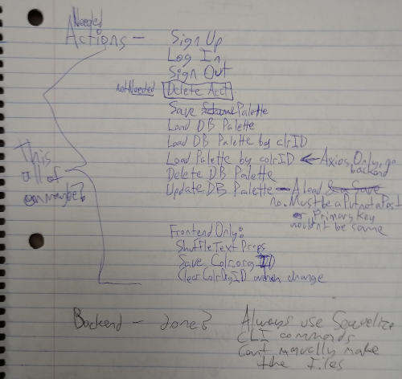

# Color Scheme Explorer Web App

Live App: http://color-scheme-explorer.herokuapp.com/color-explorer#/
* Note: some features as of 12/20/2019 may require using the app in http, NOT https, unfortunately

## New Features
* Load colr schemes from colr.org by colr.org ID# (1 to 17564 at last count, though some IDs may be be deleted)
* Save and load color schemes under a logged in user profile (incomplete)
* Shuffle Text Properties
* Improved randomized texts

## Missing Feature
* Problems with asynchronous data loading ruined Thursday
* The profile page which hasn't worked was to be the linchpin of the Project 4 Starter Code frontend and my project 2 Color Schemes Tester
* Save notes and names for user color schemes
* View user's saved schemes with ID #s, notes and names for schemes 

This program enables the user to, at the click of a button:

* get random color schemes from colr.org
* shuffle the layout of the 3 HTML element groups in the testing area, within certain bounds
  * shuffling layout also gets random paragraph text from hipsterjesus.com, which is like lorem ipsum with different words
* to change the page background to random, antiquewhite, and blue-black
  * the color value for randomize page background is set by JavaScript, not colr.org

And, with just a bit of typing:

* manually adjust all 11 of the 10 effectual color settings with hex values
* and have a running log of the deleted hex colors on screen

Until the browser tab is closed or reloaded:

* all the color and layout values are persistent while switching between the apps functions / pages

When you reload the page:

* The test area layout is reset to default
* The colors and color history are all set back to default / none

If the app is open in multiple tabs:

* Each tab has independent color, position, and deleted color values
* You can continue viewing random schemes and tweaking things in one or more tabs while you work on configuring your ideally customized color lineup in the third

### Try the app live at:
https://color-scheme-explorer.herokuapp.com/color-explorer#/

## User Stories

* "As a designer, I want to experiment on screen with more color combinations more quickly so I can diversify and perfect my color design"
* "As a designer, I want to easily sample pre-built palettes so I can have more choices while saving time."
* "As a designer, I want to experiment with human-built palettes rather than palettes calculated by formulas"
* "As a designer, I want to experiment in a web-page- or textual-design-like environment rather than a palette application so I can have a more realistic read of the color combinations off the bat"
* "As a householder or interior designer, I want to experiment with colors more easily that I can print out and take to the paint store so I can have more choices and better outcomes in painting or design projects"
* "As an artist, I want to compare and contrast colors on screen before I start mixing paints so I can have better results while saving time and money"
* "As a UI designer or QA person, I want to do user testing with the color-blind or other special audiences, so that I can reacha wider audience effectively"

### Randomize Colors Page Wireframe

### Randomize Layout Block Wireframe

### Profile Page Wireframe

### Needed Actions Notes

